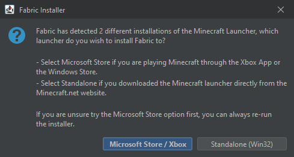
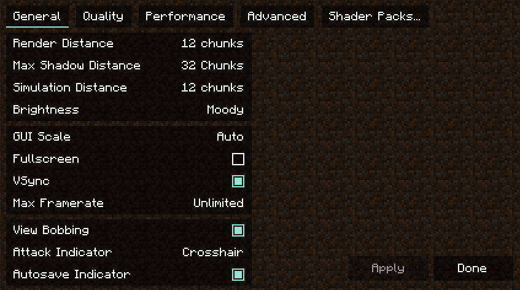
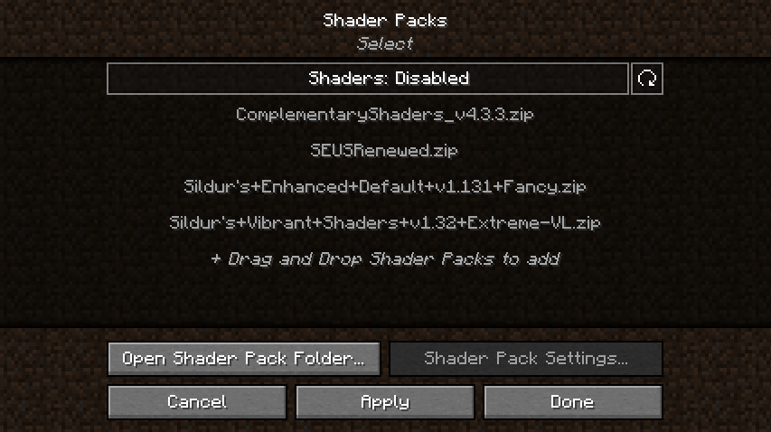
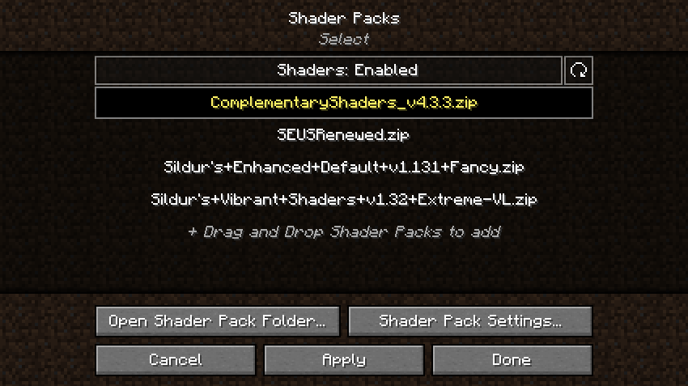

# Iris installation and usage guide

This guide is created to serve as an all-in-one reference for all the things you might want to know about the Iris Shaders mod. It will be periodically updated as the mod itself evolves.  
Last updated on March 7, 2022.

### Introduction

Iris Shaders is a brand new work-in-progress shaders mod for the Fabric mod loader. It aims to provide full Optifine shader compatibility while offering superior performance. This is achieved by building Iris to be compatible with [Sodium](https://www.curseforge.com/minecraft/mc-mods/sodium), an optimization mod by JellySquid which significantly increases chunk rendering performance and reduces stutters.

### Contents

1. [Installing Iris](#installing-iris)
    - [For standalone use](#for-standalone-use)
    - [For use with other Fabric mods](#for-use-with-other-fabric-mods)
    - [Manual installation](#manual-installation)
2. [Using Iris](#using-iris)
3. [Shader compatibility](#shader-compatibility)
4. [Compatibility with other Fabric mods](#compatibility-with-other-fabric-mods)
5. [Support and useful links](#support-and-useful-links)

## Installing Iris

### For standalone use

This method is recommended for users who want to play with **Iris shaders only, without any other mods**.

1. Go to the [Iris shaders download page](https://irisshaders.net/download).

2. Click on "Download universal JAR".
3. Save the file anywhere on your computer and run it.  
   Java is required to run the installer. If your system doesn't have Java installed, download and install Java from [Adoptium Java downloads](https://adoptium.net/).
   If you are using Windows and are still unable to run the installer, try using [Jarfix](https://johann.loefflmann.net/en/software/jarfix/index.html).
4. The following window should open:   
   
5. Under the "Select game version" dropdown, select your preferred Minecraft version.
6. Click Install.
7. If you get the following prompt:  
     
   Select **Microsoft Store / Xbox** if you have updated to the new launcher. Otherwise, select **Standalone (Win32)**.
8. You should see the button say "Installation succeeded!" next to the full progress bar:  
   
9. Close the installer.
10. Next time when you open the Minecraft launcher, you should have the following profile (the version numbers may be different):  
      
    Play the game with this profile selected to run Iris Shaders!

### For use with other Fabric mods

This method is recommended for users who want to **use other Fabric mods in combination with Iris Shaders**.  
Make sure to check the [**Compatibility with other Fabric mods**](#compatibility-with-other-fabric-mods) section to ensure all your other mods are going to work properly with Iris and Sodium.

1. Follow steps 1 to 5 under the [For standalone use](#for-standalone-use) section.

2. **Check "Install as Fabric mod"**:  
   
3. Follow steps 6 to 9 under the [For standalone use](#for-standalone-use) section.
4. Place your other Fabric mods in the mods folder. The location of the mods folder depends on your operating system:
    - Windows: `%APPDATA%\.minecraft\mods`  
    - Linux: `~/.minecraft/mods`  
    - MacOS: `~/Library/Application Support/minecraft/mods`
5. Next time when you open the Minecraft launcher, you should have the following profile (the version numbers may be different):  
     
   Play the game with this profile selected to run the game with Iris Shaders and the rest of your Fabric mods!
    
### Manual installation

This method is for users who want to manually install Iris and Sodium, and optionally use them with other Fabric mods.  
Make sure to check the [**Compatibility with other Fabric mods**](#compatibility-with-other-fabric-mods) section to ensure all your other mods are going to work properly with Iris and Sodium.  
**If you already have a Fabric profile set up, start from step 8**.

1. Go to the [Fabric loader download page](https://fabricmc.net/use/).
2. Click on "Download installer (Universal/.JAR)".
3. Save the file anywhere on your computer and run it.  
   Java is required to run the installer. If your system doesn't have Java installed, download and install Java from [Adoptium Java downloads](https://adoptium.net/).  
   If you are using Windows and are still unable to run the installer, try using [Jarfix](https://johann.loefflmann.net/en/software/jarfix/index.html).
4. The following window should open:  
   
5. Under the "Minecraft Version" dropdown, select your preferred Minecraft version.
6. Click Install.
7. You should get the following prompt:  
     
   Click OK and close the installer.
8. Download Iris and Sodium from your website of choice:
    - Iris Shaders: [Curseforge](https://www.curseforge.com/minecraft/mc-mods/irisshaders), [Modrinth](https://modrinth.com/mod/iris)  
    - Sodium: [Curseforge](https://www.curseforge.com/minecraft/mc-mods/sodium), [Modrinth](https://modrinth.com/mod/sodium)  
   
   The following table shows which version of Sodium you need based on your Minecraft version:
   
   | Minecraft    | Sodium       |
   |:------------:|:------------:|
   | 1.16.5       | 1.16.5-0.2.0 |
   | 1.17.1       | 1.17.1-0.3.4 |
   | 1.18.2       | 1.18.2-0.4.1 |
9. Place the downloaded files (and optionally your other Fabric mods) into the mods folder. The location of the mods folder depends on  your operating system:
    - Windows: `%APPDATA%\.minecraft\mods`  
    - Linux: `~/.minecraft/mods`  
    - MacOS: `~/Library/Application Support/minecraft/mods`
10. Next time when you open the Minecraft launcher, you should have the following profile (the version numbers may be different):  
      
    Play the game with this profile selected to run the game with Iris Shaders and the rest of your Fabric mods!

## Using Iris

After you install Iris using one of the methods described in the [Installing Iris](#installing-iris) section, make sure that it is properly installed by going into the Minecraft video settings. The video settings menu should look like this:  

You probably noticed that the menu is completely different. It is a reworked video settings menu provided by Sodium. In the **General** and **Quality** tab, you can find all the usual settings from vanilla Minecraft which you can change to fit your preferences. The settings in the Performance and Advanced tabs should not be modified in most cases.  

Shader packs are managed in the **Shader packs** tab. The shader pack menu should look like this:  

This menu shows shader packs which are in the shader packs folder. You can add new shader packs by dragging and dropping them into this menu, or by clicking the "Open Shader Pack Folder..." button and adding the shader packs into the opened folder. After adding your shader packs to the shader pack folder, click the refresh button in the top right to refresh the list of shaders. To select a shader pack, click on "Shaders: Disabled" to enable them. After that, select the shader pack you want to enable by clicking on it, then enable the selected shader by clicking the Apply button.  

In the following example, we have successfully enabled Complementary Shaders. Notice how the font of the enabled shader changed to yellow - this is used to indicate that the shader is, in fact, enabled:

After enabling the selected shader, you can now configure it by clicking on the "Shader Pack Settings..." button. The shader pack settings menu is going to look different for each shader, since the available options are defined by the shader itself. For example, this is how the menu looks like with Complementary Shaders enabled:  

Here you can edit the shader pack options provided by the shader itself. The options in the menu should be the exact same as the options you'd get by loading the shader in Optifine. There are a few additional functions in the top right of the menu, however:

-  Import button: Loads a shader setting file (.txt format) into the currently enabled shader. The button opens up a file selection prompt, letting you select the file. Useful for loading custom shader settings found online.
-  Export button: Exports your currently active shader settings to a .txt file. Useful for sharing your custom shader settings.
-  Reset button: Hold Left SHIFT and click this button to restore the default settings for the selected shader.

After you're done with customizing the shader, click Apply to apply the changes. You can now go back to the shader pack list by clicking on the "Shader Pack List..." button, or to the video settings menu by clicking the "Done" button.  

You can now load your world and play Minecraft with shaders! While in game, you can use **keyboard shortcuts** which allow you to quickly manage your shaders:  

- Pressing "**O**" opens up the shader packs menu with a transparent background, so you can see the changes you're making to the shader settings happen in real time.
- Pressing "**K**" toggles shaders on and off.
- Pressing "**R**" reloads the currently active shader pack.

You can rebind these keyboard shortcuts to any other key you want in the Controls menu.

## Shader compatibility

For a list of compatible shaders, check out the [supported shaders list](supportedshaders.md).

Other shaders are considered **unsupported** at the moment. When using shaders which are not in this list, except them to have major visual problems, or even not run at all. More shaders will be added as supported as new features are being added to Iris.

For a list of known bugs with certain shaders, check out the [shader pack bug list](ShaderpackBugs.md).

## Compatibility with other Fabric mods

Iris and Sodium are made with high mod compatibility in mind, so they should be minimally invasive when it comes to mod compatibility. However, there are exceptions, which are listed in this section.

### Obvious incompatibilities

- OptiFabric: duh
- Canvas: Conflicts with renderer changes made by Sodium - fully incompatible

### Sodium's incompatibility with the Fabric Rendering API

If you are using **ANY** of the following mods:  

- Applied Energistics 2
- Tech Reborn
- Industrial Revolution
- Modern Industrialization
- Bits and Chisels
- Ignis Fatuus
- Requiem
- Campanion
- Continuity
- ConnectedTexturesMod
- LambdaBetterGrass
- Enhanced Block Entities
- Art of Alchemy
- Materialisation
- Simple BC Pipes

... and many others which could possibly utilize the Fabric Rendering API, **you will experience issues when playing the game**.

**Solution**: Download **Indium** ([Curseforge](https://www.curseforge.com/minecraft/mc-mods/indium), [Modrinth](https://modrinth.com/mod/indium)) and add it to your mods folder.  

Make sure to download the version that supports your current version of Sodium:

| Sodium       | Indium       |
|:------------:|:------------:|
| 1.16.5-0.2.0 | 1.0.0 for 1.16.5 |
| 1.17.1-0.3.4 | 1.0.1 for 1.17.1 |
| 1.18.2-0.4.1 | 1.0.2 for 1.18.2 |  

**Keep in mind that this list does not cover all the mods which won't work properly without Indium**. If blocks or items from a certain mod are invisible or are not displaying correctly, or the mod crashes your game, chances are high that the mod requires Indium to work properly with Iris and Sodium.

### ReplayMod

ReplayMod provides builds of Sodium that are compatible with a specific version of both ReplayMod and Iris. You can download them at the [ReplayMod downloads page](https://www.replaymod.com/download/) by clicking on "Show compatible Sodium versions".

### Immersive Portals

Check the [Immersive Portals Curseforge page](https://www.curseforge.com/minecraft/mc-mods/immersive-portals-mod) for notes on compatibility with Iris and Sodium.

## Support and useful links

### Support

Before directly asking for support, check the [list of frequently asked questions](faq.md) and see if your can find the answer to your question here. If not, feel free to join our [Discord server](https://discord.gg/jQJnav2jPu) and ask us directly in the `#iris-support` channel!

If you have any suggestions in regards to this specific guide, contact me on Discord: pajic#0234. I am a part of the support team on the Iris discord server.

### Useful Links

- [Iris Shaders official website](https://irisshaders.net/)
- [Iris Shaders Github repository]( https://github.com/IrisShaders/Iris/)
- [Website for Sodium and other projects by JellySquid](https://jellysquid.me/projects)
